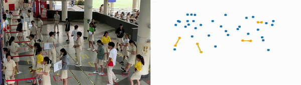

<p align="center"></p>


<p align="center">>>Made by Soh Wei Kiat, Warren Low Keng Hoong, Zhou Chengyang and Xue Yuqing</p>

# School-YOLO
A project to assist Hwa Chong in automating their Covid-19 monitoring operations in the canteen

# Disambiguation
 To find the code where the students are tracked by the DEEPSORT algorithm, please head over to the branch found (https://github.com/DESU-CLUB/School-YOLO/tree/deepsort-tracker/deep_sort)[here]


# Quick Start
 1) Download YOLOv3 or tiny_yolov3 weights from [here](https://drive.google.com/file/d/1uvXFacPnrSMw6ldWTyLLjGLETlEsUvcE/view) (yolo.h5 model file with tf-1.4.0) , put it into model_data folder.  
 2) cd to School YOLO folder  
 3) Run the code with cmd (Recommended if your computer has a powerful GPU): 
 ```
     pip install -r requirements.txt
     python3 Combined_GUI.py
 ```
 After a while, the video files should be outputted in output_videos folder 
 
 You can view the files named detections.mov and minimap.mov
 
 # Quick Start: (But its Colab for those without GPUs)
 1) Git Clone Everything and upload into drive 
 
 2) Upload main.ipynb onto Google Colab    
 
 3) Follow the steps there to run the code 
 

# User Input required  
1) Video Path Flag
```
Input video path here:
```
Just input the path of the video <strong>to be processed</strong> here

2) Calibration Flag
```
Do you wish to calibrate the input?(Y/N):
```
This flag is to check whether user would like to modify the Bird Eyes View Transformation of the image

3) Social-Distancing Flag
```
Do you want to check the social distance (Y/N):
```
This flag is to check whether user would like to include a visual representation of whether students are socially distanced


# Output 
## If Social-Distancing Flag is set to true (You answered yes to the 3rd qn asked)
2 files, named detections.mov and minimap.mov


  
## If Social Distancing Flag is set to False (You answered no to the 3rd qn asked)


# Dependencies 
This code can only be run on Python 3.7, with the following dependencies:
```
tensorflow==1.13.2 (Preferably Tensorflow 1.x, as Tensorflow 2 and above is not supported)
numpy==1.18.1
opencv_python==4.1.2.30
Keras==2.3.1
scipy==1.4.1
matplotlib==3.1.2
Pillow==7.2.0
scikit_learn==0.23.1

```

# Acknowledgements
Most of the code were pulled from QiDian's respository found [here](https://github.com/Qidian213/deep_sort_yolov3) <br>
Also, StackOverflow was also consulted in the making of this repository

# License
## MIT LICENSE
Copyright 2020 HCIRS ML Division

Permission is hereby granted, free of charge, to any person obtaining a copy of this software and associated documentation files (the "Software"), to deal in the Software without restriction, including without limitation the rights to use, copy, modify, merge, publish, distribute, sublicense, and/or sell copies of the Software, and to permit persons to whom the Software is furnished to do so, subject to the following conditions:

The above copyright notice and this permission notice shall be included in all copies or substantial portions of the Software.

THE SOFTWARE IS PROVIDED "AS IS", WITHOUT WARRANTY OF ANY KIND, EXPRESS OR IMPLIED, INCLUDING BUT NOT LIMITED TO THE WARRANTIES OF MERCHANTABILITY, FITNESS FOR A PARTICULAR PURPOSE AND NONINFRINGEMENT. IN NO EVENT SHALL THE AUTHORS OR COPYRIGHT HOLDERS BE LIABLE FOR ANY CLAIM, DAMAGES OR OTHER LIABILITY, WHETHER IN AN ACTION OF CONTRACT, TORT OR OTHERWISE, ARISING FROM, OUT OF OR IN CONNECTION WITH THE SOFTWARE OR THE USE OR OTHER DEALINGS IN THE SOFTWARE.

    
    
