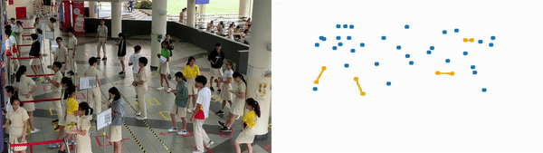

  
Made by Soh Wei Kiat, Warren Low Keng Hoong, Zhou Chengyang and Xue Yuqing  

# School-YOLO
A project to assist Hwa Chong in automating their Covid-19 monitoring operations in the canteen

# Quick Start
 Download YOLOv3 or tiny_yolov3 weights from [here](https://drive.google.com/file/d/1uvXFacPnrSMw6ldWTyLLjGLETlEsUvcE/view) (yolo.h5 model file with tf-1.4.0) , put it into model_data folder.

 Run the code with cmd (Recommended if your computer has a powerful GPU): 
 ```
     python3 COMBINED_GUI.py
 ```
 After a while, the video files should be outputted in output_videos folder
 You can view the files named detections.mov and minimap.mov
 
 # Quick Start: (But its Colab for those without GPUs)
 1) Git Clone Everything and upload into drive   
 
 2) Upload main.ipynb onto Google Colab    
 
 3) Follow the steps there to run the code 
 

# User Input required  
1) Video Path Flag
```
Input video path here:
```
Just input the path of the video <strong>to be processed</strong> here

2) Calibration Flag
```
Do you wish to calibrate the input?(Y/N):
```
This flag is to check whether user would like to modify the Bird Eyes View Transformation of the image

3) Social-Distancing Flag
```
Do you want to check the social distance (Y/N):
```
This flag is to check whether user would like to include a visual representation of whether students are socially distanced


# Output 
## If Social-Distancing Flag is set to true (You answered yes to the 3rd qn asked)
2 files, named detections.mov and minimap.mov


  
## If Social Distancing Flag is set to False (You answered no to the 3rd qn asked)


# Dependencies
```
    NumPy
    sklearn
    OpenCV
    Pillow
    Tensorflow (Preferably before Tensorflow 2.0, as it is not supported)
    Matplotlib
    SciPy
    Keras
```

# Acknowledgements
Most of the code were pulled from QiDian's respository found [here](https://github.com/Qidian213/deep_sort_yolov3) <br>
Also, StackOverflow was also consulted in the making of this repository

    
    
